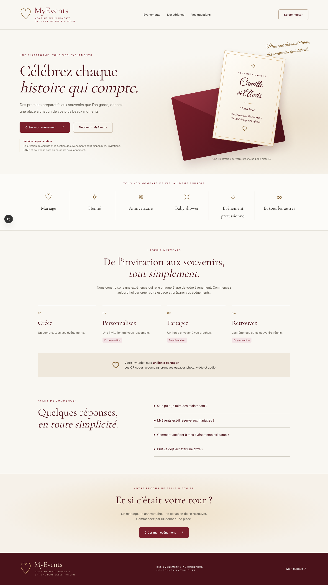

# Accueil — livraison de préparation du 20 septembre 2026

Références : PRODUCT-SPEC §5, écran 01 du carrousel, images 1 et 7 transmises
le 20 septembre. Exigences concernées : PROD-01-001 à PROD-01-004. Cette livraison
remplace le placeholder de fondation, sans déclarer la landing commerciale complète.

## Réalisé

- Accueil responsive ivoire/bordeaux, typographies Cormorant Garamond et Great
  Vibes déjà présentes dans les références, servies localement.
- Composition HTML/CSS d'une invitation et d'une enveloppe. Ce visuel est une
  illustration, pas un modèle sélectionnable ni une invitation publiée.
- CTA de création vers `/events/new`, connexion réelle, ancres et FAQ au clavier.
- Types d'événements et distinction invitation par lien / QR souvenirs.
- État « version de préparation » explicite : aucune statistique, note client,
  tarification, démonstration fonctionnelle ou disponibilité commerciale inventée.

## Comparaison visuelle

Les captures desktop 1440 px et mobile 390 px ont été inspectées : hiérarchie
serif/script, palette, enveloppe, sections et footer reprennent la direction des
images. Aucun débordement observé. L'illustration reste graphique ; les photographies
florales, le logo floral définitif, les cartes de modèles et la présentation
commerciale complète ne sont pas revendiqués comme équivalents aux maquettes.

## Vérification

`tests/e2e/home.test.ts` couvre les liens vers l'authentification, la transparence
sur les offres non disponibles, le clavier et la FAQ, l'absence de débordement à
360/390/1440 px et Axe WCAG 2.2 AA. Contrôle préliminaire sur le serveur connecté :
zéro violation Axe à 390 et 1440 px. Résultat final dans `docs/PROGRESS.md`.

Le CTA PROD-01-003 est couvert par le parcours Auth/Event existant. Le statut de
la landing globale reste **partiel** : catalogue, packs, démonstrations réelles,
modèles et pages professionnelles restent nécessaires. Aucun besoin métier n'est
supprimé par cette livraison intermédiaire.

