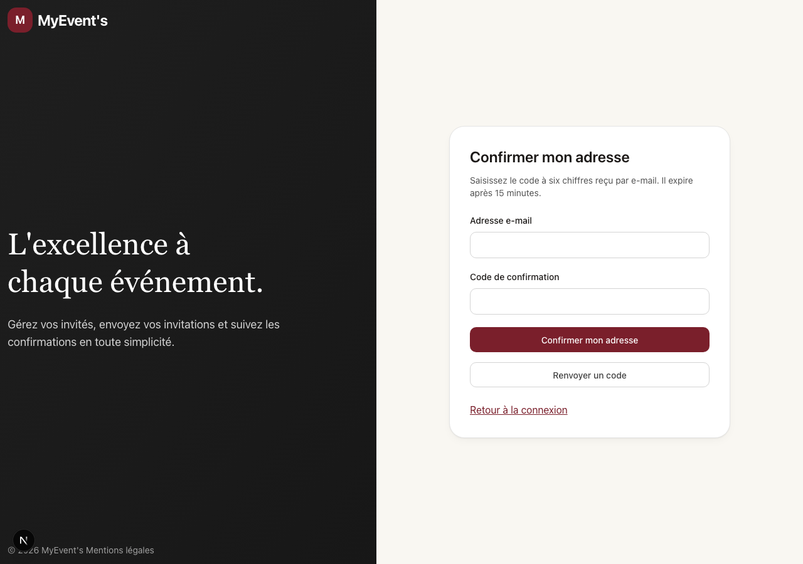
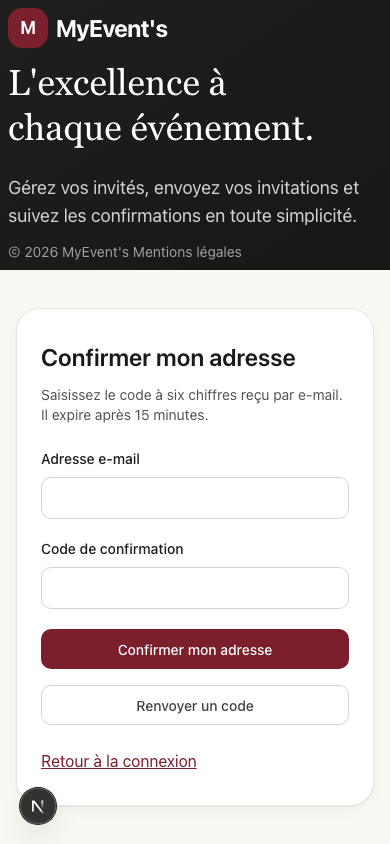

# Neon — reprise du socle Auth et événements

15 septembre 2026. Périmètre DEC-DEP-002, gratuit uniquement, branche
`migration-staging` du projet `twilight-mode-52723515`. Références :
AUTH-09-001/002, AUTH-10-001, AUTH-11-001, EVENT-14-001, EVENT-15-001,
PRODUCT-SPEC §68/78, Security Contract et GAP-016. Le socle local reste disponible.

## Données et autorisations vérifiées

- Les migrations `neon/migrations/0001_application.sql` et
  `0002_legacy_import.sql` ont été appliquées le 14 septembre à 20:41:58 UTC.
  Le nouveau schéma `myevents` contient **1 profil, 1 espace et 2 événements**.
  Les identifiants source, relations, dates et statuts sont préservés. La langue
  d'affichage initiale est `fr`, valeur du socle ; la source n'avait pas ce champ.
- Les empreintes avant/après des lignes des **39 tables restaurées** concordent.
  Les données historiques `public`, `auth`, `private`, `storage` et
  `supabase_migrations` restent intactes. Les deux sous-événements restent dans
  leur table source ; aucune fonctionnalité de sous-événement n'est revendiquée.
- Preuve privée : `neon-application-verified.json` dans le répertoire de sauvegarde
  décrit dans `docs/NEON-MIGRATION.md`. Les SQL appliqués sont identifiés par SHA-256.
- Le rôle d'exécution `myevents_app` n'est ni propriétaire ni `BYPASSRLS`. Il n'a
  accès ni à l'ancien schéma Auth ni aux sessions brutes Neon. Une connexion réelle
  sans session vérifiée voit zéro événement. Le propriétaire reste réservé aux
  scripts de migration et aux tests administratifs explicitement activés.
- Drizzle et `pg` utilisent des paramètres SQL et un pool attaché au cycle Vercel.
  Chaque opération porte des identifiants de compte/session vérifiés dans une
  transaction ; les variables PostgreSQL sont locales à cette transaction.
- RLS vérifie utilisateur, session correspondante, expiration, adresse confirmée,
  bannissement, tenant et rôle membre. Une session antérieure à la modification
  d'un compte à mot de passe perd l'accès applicatif. Les changements d'identité
  d'événement et de statut sont refusés ; la suppression est logique.
- Les huit statuts source sont lisibles. Modifier un événement déjà
  `ready_for_publish` conserve ce statut ; aucune nouvelle transition n'est créée.

## Auth et reprise du compte

Neon Auth Managed Better Auth est actif sur cette branche. La confirmation
obligatoire a été activée ; le fournisseur e-mail partagé gratuit utilise un code
OTP. Le nouveau formulaire réutilise les composants Auth, avec labels, autofill,
erreurs, renvoi et confirmation. Il est accessible à `/confirmer-adresse` en mode
Neon. GAP-016 documente l'absence d'une maquette OTP canonique.

Le SDK serveur appelle les méthodes de connexion, inscription, OTP et reset. Les
lectures d'autorisation ignorent le cache de cookie du SDK et interrogent la
session amont. Le test de transport utilise le SDK installé, avec HTTP simulé.
Les méthodes d'inscription et reset appliquent la politique locale de 15 à 128
caractères avant l'appel fournisseur. Les détails internes ne sont pas exposés.

**La reprise du compte historique reste en attente de son nouvel accès confirmé.**
Les hashes Supabase ne sont pas réutilisés. Un utilisateur nouvellement inscrit
avec l'adresse historique ne reçoit pas automatiquement les anciens événements.
`scripts/migration/bind-legacy-identity.mjs` exige les deux UUID explicitement
sélectionnés, la confirmation des deux adresses et leur concordance, l'absence
d'un rattachement contradictoire et une cible sans autre profil applicatif.
Il conserve l'identifiant du profil et le tenant source.

Le propriétaire doit créer son accès dans l'application et y saisir le code reçu.
Aucun mot de passe ni code n'est demandé dans la conversation. Les tests de cette
session n'envoient ni e-mail de confirmation ni e-mail de récupération.

## Contrôles

| Contrôle                                                                       | État et preuve                                                                                                                                                                                                          |
| ------------------------------------------------------------------------------ | ----------------------------------------------------------------------------------------------------------------------------------------------------------------------------------------------------------------------- |
| Schéma et repositories PostgreSQL                                              | verified : `tests/integration/neon/Database.test.ts`, 5 scénarios PGlite exécutant les migrations réelles                                                                                                               |
| RLS sur Neon distant                                                           | verified : `tests/connected/neon.test.ts`, 1 scénario sur la branche de migration ; fixtures Auth/événements et permission temporaire de changement de rôle annulées par rollback                                       |
| Auth adapter et configuration                                                  | Tests unitaires de politique de mot de passe, confirmation, erreurs génériques, noms, mapping explicite, cibles autorisées et transport du SDK                                                                          |
| UI connectée et accès anonyme                                                  | verified : `tests/neon-ui/auth.test.ts`, redirection dashboard vers connexion, aucun débordement mobile, zéro violation Axe sérieuse/critique                                                                           |
| Confirmation visuelle                                                          | Captures desktop et mobile inspectées : carte lisible, champs et actions distincts. Espacements explicites pour éviter les tokens de 4/8 px du projet. Extension GAP-016 ; parité OTP avec une maquette non revendiquée |
| Suite complète                                                                 | `corepack pnpm check:full` réussi le 20 septembre : 147 tests ; détails dans `docs/PROGRESS.md`                                                                                                                         |
| Auth réel avec e-mail, reprise du compte, CRUD authentifié après redéploiement | **En attente** ; les tests SQL et HTTP simulés ne valident pas ces parcours                                                                                                                                             |
| Vercel Preview                                                                 | Non déployé ; dépend de la reprise Auth et des tests connectés complets                                                                                                                                                 |

## Reproduire

`corepack pnpm dev:neon` lance l'application sur `http://localhost:3300` avec
`.env.neon.local` (ignoré par Git, permissions `0600`). Le mode habituel reste local.
Ne pas utiliser la connexion propriétaire comme `DATABASE_URL` de l'application.

`corepack pnpm exec playwright test -c playwright.neon.config.ts` vérifie le
formulaire connecté sans envoyer d'e-mail. Le serveur précédent doit être lancé.
Le test SQL distant nécessite explicitement `NEON_TEST_DATABASE_URL`, connexion
propriétaire directe de la seule branche autorisée ; toutes ses mutations sont
annulées. Les secrets ne doivent pas apparaître dans les arguments de commande.

La production et Stripe Live restent verrouillés. La source Supabase et la
branche Neon par défaut ne sont pas basculées. L'inventaire des configurations
hors PostgreSQL reste à compléter avant de déclarer la migration totale terminée.
